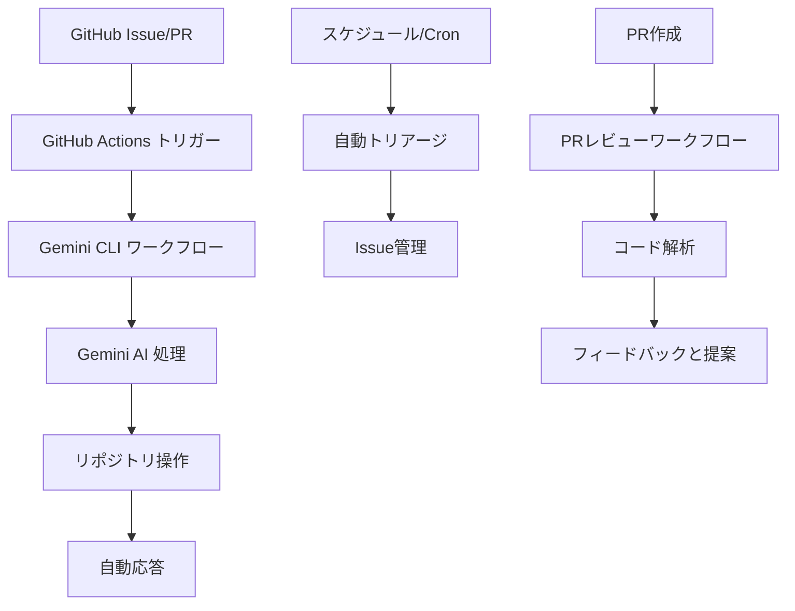

<div align="center">

# Gemini Actions Lab

<a href="./README.md"></a>
<a href="./README.ja.md"></a>

[](https://github.com/Sunwood-ai-labsII/gemini-actions-lab/actions/workflows/gemini-cli.yml)


</div>

---

## 📖 概要

このリポジトリは、GoogleのGemini AIをGitHub Actionsと統合するための実験室およびショーケースとして機能します。生成AIの力を利用して、さまざまなリポジトリ管理タスクを自動化する方法を示します。

### 🎯 主な機能
- **AIによる自動化**: Geminiを活用して、Issueのトリアージ、プルリクエストのレビューなどのタスクを処理します。
- **CLIライクな対話**: Issueのコメントから直接AIアシスタントと対話します。
- **拡張可能なワークフロー**: 独自のプロジェクトに合わせてワークフローを簡単に適応およびカスタマイズできます。

---

## 🤖 ワークフロー

このリポジトリには、以下のGitHub Actionsワークフローが含まれています：

### 📄 `gemini-cli-jp.yml`
- **トリガー**: Issueのコメント
- **機能**: ユーザーがIssueにコメント（例：`@gemini-cli-jp /do-something`）を作成することで、Gemini搭載のCLIアシスタントと対話できるようにします。アシスタントは、ユーザーのリクエストに基づいてリポジトリでアクションを実行できます。

###  triage `gemini-issue-automated-triage.yml`
- **トリガー**: Issueの作成または編集
- **機能**: 新規または更新されたIssueを自動的にトリアージします。Geminiによって決定されたIssueの内容に基づいて、ラベルの追加、担当者の割り当て、またはコメントの投稿ができます。

### 🕒 `gemini-issue-scheduled-triage.yml`
- **トリガー**: スケジュールされたcronジョブ
- **機能**: 定期的にオープンなIssueをスキャンし、古いIssueの特定や優先順位の提案などのトリアージタスクを実行します。

### 🔍 `gemini-pr-review.yml`
- **トリガー**: プルリクエストの作成または更新
- **機能**: プルリクエストを自動的にレビューします。Geminiは、コードの品質に関するフィードバックの提供、改善の提案、または潜在的な問題の特定ができます。

### 🔄 `sync-to-report-gh.yml`
- **トリガー**: mainブランチへのプッシュ
- **機能**: これは以前のテンプレートからのレガシーワークフローであり、このラボでは積極的に使用されていません。日次レポートを中央リポジトリに同期するように設計されていました。

---

## 📸 スクリーンショットと例

### 🤖 CLIの対話例
Issueを作成し、`@gemini-cli-jp /help`とコメントして、利用可能なコマンドを確認します:

```
@gemini-cli-jp /help
```

AIアシスタントが利用可能なコマンドと使用例を返信します。

### 🏗️ ワークフローのアーキテクチャ


### 💬 対話の例

**コードレビューのリクエスト:**
```
@gemini-cli-jp /review-pr
このプルリクエストをレビューし、改善点を提案してください
```

**Issueのトリアージ:**
```
@gemini-cli-jp /triage
このIssueを分析し、適切なラベルと担当者を提案してください
```

---

## 🛠️ トラブルシューティング

### 一般的な問題

**❌ ワークフローがトリガーされない:**
- リポジトリの設定でGitHub Actionsが有効になっているか確認してください
- リポジトリの設定でWebhookの配信を確認してください
- トリガー条件（例：コメントに`@gemini-cli-jp`が含まれているか）が満たされているか確認してください

**❌ Gemini APIのエラー:**
- `GEMINI_API_KEY`シークレットが設定されているか確認してください
- APIキーの権限とクォータを確認してください
- APIキーが有効で期限切れでないことを確認してください

**❌ 権限エラー:**
- ユーザーに書き込み権限があることを確認してください
- リポジトリがプライベートでないか確認してください（信頼されたユーザーの検出に影響します）

### ヘルプの入手方法
1. [GitHub Issues](https://github.com/your-repo/issues)で同様の問題がないか確認してください
2. 詳細なエラーログを記載した新しいIssueを作成してください
3. Issueを報告する際には、ワークフローの実行ログを含めてください

---

## 🚀 インストールとセットアップ

### 前提条件
- リポジトリ作成権限のあるGitHubアカウント
- Google AI StudioのGemini APIキー
- GitHub Actionsの基本的な理解

### クイックスタート
1. **このリポジトリをフォーク**して、自分のGitHubアカウントにコピーします
2. リポジトリの設定で**GitHubシークレットを設定**します:
   - `GEMINI_API_KEY`: あなたのGemini APIキー
   - `GITHUB_TOKEN`: (自動的に提供されます)
3. `.github/workflows/`からあなたのリポジトリに**ワークフローファイルをコピー**します
4. あなたのニーズに合わせて**ワークフローをカスタマイズ**します
5. Issueを作成し、`@gemini-cli-jp /help`とコメントして**セットアップをテスト**します

### 高度な設定
追加機能を利用するには、これらのオプションのシークレットを設定します:
- `APP_ID`と`APP_PRIVATE_KEY`: GitHub App連携用
- `GCP_WIF_PROVIDER`と関連するGCP変数: Vertex AI利用のため

---

## 📁 ディレクトリ構造

```
.
├── .github/
│   └── workflows/
│       ├── gemini-cli-jp.yml
│       ├── gemini-issue-automated-triage.yml
│       ├── gemini-issue-scheduled-triage.yml
│       ├── gemini-pr-review.yml
│       └── sync-to-report-gh.yml
├── discord-issue-bot/
│   ├── Dockerfile
│   ├── pyproject.toml
│   ├── compose.yaml
│   └── bot.py
├── .gitignore
├── LICENSE
└── README.md
```

---


## 🤖 Discord Issue Bot

Discord から直接 GitHub Issue を作成する最小ボットの詳細なドキュメントは、以下を参照してください。

- ドキュメント: [discord-issue-bot/README.md](discord-issue-bot/README.md)

## 📝 ライセンス

このプロジェクトは、[LICENSE](LICENSE)ファイルの条件に基づいてライセンスされています。

---

© 2025 Sunwood-ai-labsII


---